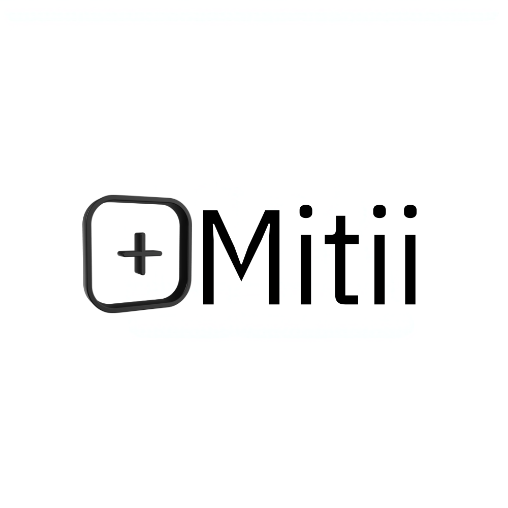
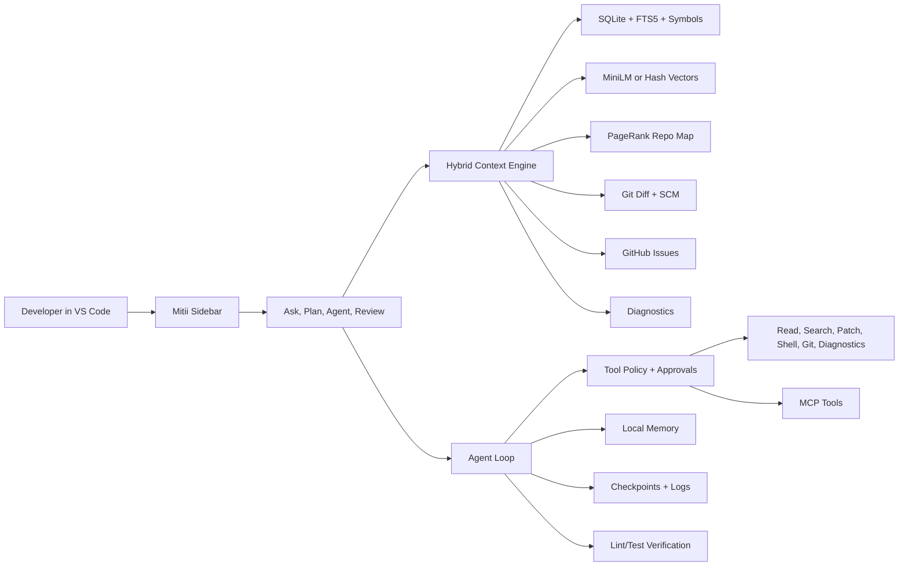
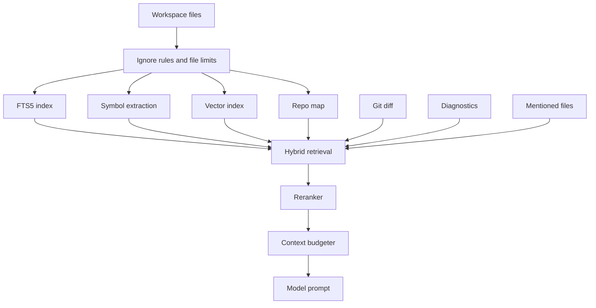
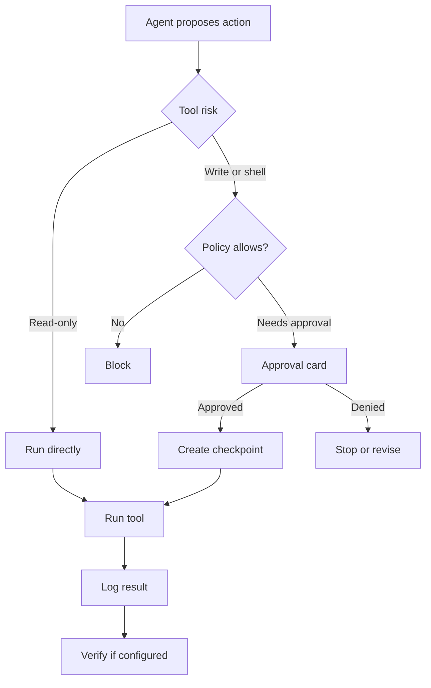
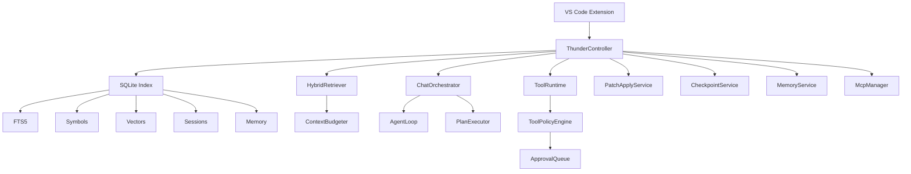

# Mitii AI Agent

<p align="center">
  
</p>

<p align="center">
  <strong>Local-first VS Code AI coding agent with deep repo context, safe Plan/Act workflows, MCP tools, memory, checkpoints, and model freedom.</strong>
</p>

<p align="center">
  <a href="LICENSE"></a>
  <a href="https://code.visualstudio.com/"></a>
  <a href="https://nodejs.org/"></a>
  
  <a href="https://mitii.dev"></a>
  <a href="https://docs.mitii.dev"></a>
</p>

<p align="center">
  <code>#ai-coding-agent</code>
  <code>#vscode-extension</code>
  <code>#local-first</code>
  <code>#mcp</code>
  <code>#ollama</code>
  <code>#openai-compatible</code>
  <code>#repo-indexing</code>
  <code>#agentic-coding</code>
  <code>#developer-tools</code>
</p>

Mitii is built for developers who want an AI agent that understands the repo before changing it. It runs inside VS Code, indexes your workspace locally, plans work before execution, asks for approval when risk is involved, and keeps a useful trail of memory, checkpoints, logs, and task plans.

Use it with Ollama, LM Studio, OpenAI-compatible endpoints, native OpenRouter, Azure OpenAI, AWS Bedrock, OpenAI, Anthropic, Gemini, DeepSeek, Cursor-compatible APIs, Codex-compatible APIs, or the Echo provider for UI testing.

**Docs:** [docs.mitii.dev](https://docs.mitii.dev)  
**Website:** [mitii.dev](https://mitii.dev)  
**Discord:** [discord.gg/sa8rubf6HH](https://discord.gg/sa8rubf6HH)  
**Built by:** [codewithshinde](https://github.com/codewithshinde)

---

## Why Mitii Exists

Most coding agents are powerful, but they often make one of these tradeoffs:

| Common problem | What usually happens | What Mitii does instead |
|---|---|---|
| Thin context | The agent sees a few open files and guesses the rest | Builds a local index with SQLite, FTS5, symbols, repo map, diagnostics, git state, and optional vectors |
| Cloud lock-in | You must use one hosted workflow or one model vendor | Lets you choose local or cloud providers, including OpenAI-compatible endpoints |
| Unsafe autonomy | File writes and commands happen too freely, or everything is blocked | Uses approval modes, autonomy presets, checkpointing, and dangerous-command blocking |
| Weak planning | The agent jumps into edits before understanding the task | Separates Plan, Agent, and Review modes |
| Lost progress | Long tasks stall after approvals or context limits | Saves task state, plans, memory, session logs, and approval wake-up checkpoints |
| Tool limits | External tools are hard to connect or audit | Supports MCP servers while still routing tools through Mitii safety policy |
| Repeated workflows | Teams paste the same instructions into every chat | Supports project rules and workspace skills through `SKILL.md` files |
| Issue-to-fix handoff | Bug reports live in GitHub while the code lives in the editor | Detects GitHub issue URLs, fetches structured issue context, and routes Agent mode through the verified bugfix path |
| Procurement evidence | Security reviewers need logs, approvals, and data-flow answers | Exports an audit pack zip and ships enterprise security/compliance docs |

Mitii is not just a chat panel. It is a workspace-aware agent runtime for real engineering work.

---

## Best Of Mitii

The strongest thing Mitii provides is a practical balance: **deep local context plus controlled execution**.

| Strength | Why it matters |
|---|---|
| Local-first workspace brain | Your repo index, memory, logs, plans, and checkpoints live in `.mitii/` inside your workspace |
| Hybrid retrieval | Combines full-text search, vectors, symbols, PageRank, mentioned files, diagnostics, and git changes |
| Plan before action | Complex work can be scoped, reviewed, and executed phase by phase |
| Approval-aware autonomy | You can stay strict, go fast, or choose a middle ground without disabling safety entirely |
| MCP without chaos | External tools are useful, but Mitii still evaluates risk before running them |
| GitHub issue ingestion | Paste a GitHub issue URL and Mitii turns title, body, labels, and comments into structured task context |
| Built for long tasks | Auto-continue, persisted task state, context compaction, and session history reduce restart pain |
| Model freedom | Use local models for privacy, cloud models for capability, or different models for Plan, Act, and research |
| Diff-first micro-tasks | Commit messages, changelog entries, and release notes use minimal Git context instead of full agent routing |

---

## Feature Map



---

## Core Features

### 1. Local-First Context Engine

Mitii creates a useful working map of your repository before it asks the model to act.

| Capability | Details |
|---|---|
| Workspace scanner | Respects `.gitignore` and `.mitiiignore`; auto-indexes when a folder opens |
| Full-text search | SQLite FTS5 with ripgrep fallback for paths not yet indexed |
| Symbol extraction | TypeScript, JavaScript, Python, Java, Go; tree-sitter with regex fallback |
| Repo map | PageRank-style scoring to surface structurally important files |
| Vector search | MiniLM embeddings through `@xenova/transformers`, with hash fallback |
| Vector backend | SQLite by default, LanceDB optional |
| Context reranking | Trims noisy candidates, for example top 20 down to top 8 |
| Token budgeting | Keeps context useful without blindly flooding the model |

### 2. Ask, Plan, Agent, And Review Modes

| Mode | Best for | Write access |
|---|---|---|
| Ask | Explanations, codebase questions, impact analysis | No |
| Plan | Features, refactors, audits, migrations, docs plans | No |
| Agent | Implementing approved work with tools | Yes, based on policy |
| Review | Inspecting diffs, tests, risk, and quality | No by default |

Plan mode produces structured work with phases such as diagnostics, review, execute, and verify. Agent mode runs the tool loop against the task. Review mode helps inspect changes without casually rewriting them.

Agent mode is implemented as the **Act** runtime internally. Act now has the same kind of headless preparation boundary as Ask and Plan:

| Act component | Purpose |
|---|---|
| `ActOrchestrator.prepare()` | Chooses direct execution, orchestrated plan-and-execute, saved-plan resume, audit, or MDX repair |
| `ActIntentRouter` | Classifies execution intent and broadens Plan to Act handoff phrases |
| `actMode` | Keeps plan-management tools out of direct Agent loops |
| `actSkillRouting` | Preloads debugging, testing, and cleanup playbooks when available |
| `actPrompts` | Injects execution contract, scope, skills, saved-plan metadata, and verification guidance |

When a plan is ready, Agent mode can resume it with explicit phrases such as `execute the plan` or natural confirmations such as `go ahead`, `implement it`, `apply it`, `finish it`, or `fix it`. If no saved plan is active, those phrases are treated as ordinary Agent requests instead of triggering a stale handoff.

### 3. GitHub Issue To Fix

Paste a GitHub issue URL in Agent mode, for example:

```text
Fix https://github.com/owner/repo/issues/123
```

Mitii detects `github.com/{owner}/{repo}/issues/{number}`, fetches the issue through the GitHub REST API when network access is allowed, and injects a structured context block containing the title, body, state, labels, assignees, milestone, and recent comments. The Act router treats the issue signal as a verified bugfix workflow, so the agent investigates the open workspace, makes scoped edits, and runs relevant verification.

If the active safety preset disables network access, Mitii still injects a lightweight reference block with the repository and issue number instead of scraping GitHub HTML. Private repository support uses a GitHub token stored in VS Code SecretStorage under `thunder.github.token` by default; the setting stores only the secret key name, not the token value.

### 4. Safer Tool Execution

Mitii gives the model real tools, but those tools pass through policy.

| Tool area | Examples |
|---|---|
| File tools | `read_file`, `read_files`, `list_files`, `write_file`, `apply_patch` |
| Search tools | text search, indexed context retrieval, path lookup |
| Shell tools | read-only and mutating command handling with approval gates |
| Git tools | diff collection, SCM context, commit message generation |
| Diagnostics | editor diagnostics and post-edit verification commands |
| Planning tools | plan tracking, task state, progress persistence |
| Research tools | parallel read-only research subagents |
| Memory tools | local memory search and write |
| Skill tools | workspace playbooks from `.mitii/skills/` |

### 5. Approval Modes And Autonomy Presets

| Mode | Behavior |
|---|---|
| `review_all` | Ask before file edits and mutating shell commands |
| `ask_edits` | Ask before file edits and delete-like shell commands |
| `ask_deletes` | Ask only before delete-like shell commands |
| `ask_commands` | Allow file edits, ask before mutating shell commands |
| `auto` | Auto-approve allowed actions; dangerous commands still blocked |

| Preset | Best for |
|---|---|
| `safe` | Strict local review, no network |
| `guided` | Balanced everyday development |
| `builder` | Fast iteration with shell review |
| `pilot` | Higher autonomy with command review |
| `enterprise` | Locked-down workflows and no network |

Mitii also supports untrusted workspace blocking, optional VS Code diff previews before patches land, automatic checkpoints before approved writes, and patch validation that refuses shell commands disguised as source code.

### 6. Memory, Logs, And Checkpoints

Mitii stores useful state locally so every serious task does not start from zero.

| System | What it stores |
|---|---|
| Memory | Decisions, facts, observations, touched files |
| Session history | `agent_sessions` and `agent_turns` in SQLite |
| Plans | `task_plans` in SQLite and `.mitii/tasks/` files |
| Logs | JSONL session logs in `.mitii/logs/` |
| Checkpoints | File-copy, git-stash, or shadow-git strategies before writes |

Post-task memory extraction can capture useful observations after completed work, so future sessions can reuse decisions without asking you to repeat context.

Audit review is available through `Mitii: Export Audit Pack`. The zip contains sanitized `session.jsonl`, `summary.md`, `manifest.json`, `tool-audit.json`, `approvals.json`, and `redaction-report.json`.

### Release Automation

Mitii includes release hygiene commands:

| Command | Output |
|---|---|
| `Mitii: Generate Changelog Entry` | Preview a Keep a Changelog-style entry from Conventional Commits |
| `Mitii: Prepare Release` | Update `CHANGELOG.md` and write `.mitii/release-notes.md` |
| `mitii changelog` | Headless changelog entry for CI/scripts |
| `mitii prepare-release` | Headless changelog + release-notes generation |
| `mitii export-audit` | Headless audit pack export from JSONL logs |

### 7. Skills And Project Playbooks

Mitii can load reusable workflow instructions from `SKILL.md` files. Bundled skills are copied into each workspace under `.mitii/skills/` on first init, and teams can add their own skills for code review, planning, debugging, testing, performance work, release flow, and cleanup.

| Skill area | Example use |
|---|---|
| Planning | Break down a large feature before code changes |
| Code review | Inspect risks, regressions, and missing tests |
| Debugging | Trace failures and propose focused fixes |
| Testing | Drive changes with test-first or verification-first steps |
| Performance | Profile, measure, and optimize carefully |
| Cleanup | Audit dead code, dependencies, and risky patterns |

### 8. MCP Integrations

Mitii can preload keyless MCP servers:

| Server | Purpose |
|---|---|
| `filesystem` | Scoped file access for the open workspace |
| `memory` | Cross-session knowledge graph |
| `sequential-thinking` | Structured reasoning helper |

You can add custom servers with `thunder.mcp.servers`, `.mitii/mcp.json`, or `.mcp.json`. MCP tools appear as `mcp__server__tool` and still pass through the same approval policy.

### 9. Developer UI

The sidebar is a React webview with:

| UI area | What it helps with |
|---|---|
| Chat | Ask questions and run agent tasks |
| Plan panel | See structured plans, phases, status, and required approvals |
| Approval cards | Approve or deny risky actions with context |
| Activity panel | Watch tool calls and subagent work |
| History | Resume previous sessions |
| Settings | Configure models, safety, indexing, memory, and MCP |
| Checkpoints | Inspect and restore saved states |
| Token meter | Understand context usage |
| Indexing status | Know when the workspace brain is ready |
| Context warnings | See when context may be thin or over budget |

Reasoning deltas from supported providers stream live in the chat UI. Use `thunder.ui.showReasoning` and `thunder.ui.reasoningPreviewMaxChars` to control visibility and inline preview size.

## Enterprise Readiness

Enterprise review materials live in [docs/enterprise](docs/enterprise/README.md). The pack covers data flow, provider boundaries, procurement FAQs, compliance mapping, Windows support, and auditability.

| Control | Setting or command |
|---|---|
| Route narrow Git/release tasks through minimal context | `thunder.context.microTaskRoutingEnabled` |
| Require local model providers | `thunder.enterprise.localProvidersOnly` |
| Strip file contents from exported audit packs | `thunder.enterprise.stripFileContentsFromAuditPacks` |
| Disable session logging | `thunder.telemetry.sessionLogging` |
| Export audit evidence | `Mitii: Export Audit Pack` |
| Windows smoke checklist | [docs/qa/WINDOWS_SMOKE.md](docs/qa/WINDOWS_SMOKE.md) |

---

## Analysis: Why This Design Works

AI coding quality is not only about the model. The agent wrapper matters just as much.

| Layer | Weak agent behavior | Mitii behavior |
|---|---|---|
| Retrieval | Greps random files or trusts open tabs | Blends lexical, semantic, structural, git, and diagnostic signals |
| Planning | Starts editing before scoping | Builds a plan for complex work and persists it |
| Safety | Trust all or block all | Uses policy, presets, approvals, checkpoints, and command risk checks |
| Continuity | Repeats work after approval pauses | Saves progress and injects wake-up checkpoints |
| Vendor choice | One model, one cloud path | Local models, cloud models, and OpenAI-compatible endpoints |
| Extensibility | Limited tool surface | Built-in tools plus MCP servers |

### Context Quality Funnel



### Safety Funnel



---

## Comparison With Other AI Coding Agents

This section is written carefully. Models and products change fast. Mitii does not claim to beat every tool in every workflow. It is strongest when you care about local context, safety controls, repo indexing, and model freedom inside VS Code.

| Agent or category | Where they are strong | Where Mitii can beat them |
|---|---|---|
| GitHub Copilot Agent Mode | GitHub ecosystem, autocomplete, cloud workflows, broad adoption | Local-first repo memory, configurable safety presets, workspace-owned logs and checkpoints |
| Cursor Agent | Polished AI editor experience, fast multi-file edits | Teams that want VS Code, self-hosted context, model freedom, and no editor migration |
| Cline | Open-source agent workflow, Plan/Act style, MCP ecosystem | Deeper built-in repo indexing, persisted plans, local memory, checkpoint strategies, context budget controls |
| Roo Code | Rich modes and agent customization | Local hybrid retrieval, repo map, SQLite memory, and built-in verification flow |
| Continue | Open model choice and IDE support | More agent-runtime depth around planning, approvals, checkpoints, and task persistence |
| Sourcegraph Cody | Large-codebase search and enterprise context | Local workspace ownership and VS Code agent execution with approval policies |
| OpenAI Codex CLI | Strong terminal agent workflow | Developers who prefer a VS Code sidebar, visual approvals, local indexing, and persistent workspace memory |
| Claude Code | Strong terminal-first agent patterns | VS Code-native workflow with local repo index, approval cards, checkpoints, and provider flexibility |

### Where Mitii Wins Most Often

| Use case | Mitii advantage |
|---|---|
| Private or regulated repositories | Keep the index, logs, plans, memory, and checkpoints in the workspace |
| Large refactors | Plan/Act workflow plus hybrid retrieval and verification |
| Long-running tasks | Auto-continue, task-state persistence, session history, and wake-up checkpoints |
| Teams that need guardrails | Approval modes, autonomy presets, untrusted workspace blocking, dangerous-command blocking |
| Local model setups | Ollama and OpenAI-compatible providers are first-class |
| Cloud routing | Native OpenRouter headers/reasoning, Azure OpenAI deployment URLs, and AWS Bedrock Converse support are built in |
| Custom internal tools | MCP support without skipping Mitii's policy layer |
| VS Code users | No need to move to a separate AI editor |

### Where Others May Still Be Better

| Need | Tool category that may fit better |
|---|---|
| Inline autocomplete as the main feature | Copilot, Cursor, or other autocomplete-first tools |
| Fully managed async cloud PR generation | Cloud coding agents |
| Enterprise code search across many remote repos | Sourcegraph-style code intelligence platforms |
| Terminal-only workflows | Codex CLI, Claude Code, or other terminal agents |

Mitii's goal is focused: be the best local-first, repo-aware, safety-controlled coding agent inside VS Code.

---

## Current Limits And What Is Improving

Honest projects get adopted faster because developers can trust the README.

| Area | Current state |
|---|---|
| First indexing run | Large workspaces can take time on the first scan |
| Native modules | `better-sqlite3` may need an Electron rebuild for VS Code or Cursor |
| Model quality | Final coding quality still depends on the model you connect |
| Autocomplete | Mitii is an agent and context engine, not an inline-completion product |
| Cloud workers | Mitii does not run a hosted background agent service |
| Benchmarks | Real-world results depend on repo size, model, provider latency, and safety settings |

This is why Mitii focuses on visible plans, local logs, checkpoints, and verification instead of pretending the agent is magic.

---

## Quick Start

**Requirements**

| Tool | Version |
|---|---|
| VS Code | 1.85+ |
| Node.js | 20+ |
| npm | 9+ |

```bash
git clone https://github.com/codewithshinde/mitii-ai-agent.git
cd mitii-ai-agent
npm run setup
```

`npm run setup` installs dependencies, compiles the extension and webview, rebuilds native modules for VS Code on macOS, and rebuilds local Node native modules for tests. Press **F5** in VS Code to launch the Extension Development Host. Open a folder, wait for the indexing status in the Mitii sidebar, then start chatting.

### Connect A Model

1. Open **Settings** in the Mitii sidebar, or VS Code settings under `Mitii AI Agent`.
2. Set `thunder.provider.type` to `openai-compatible`, `openrouter`, `azure-openai`, or another supported provider.
3. Point `thunder.provider.baseUrl` at your endpoint. The default is `http://localhost:11434/v1` for Ollama.
4. Set `thunder.provider.model`. The default is `qwen3-coder:30b`.

Use the Echo provider for UI testing without an LLM. API keys are stored through VS Code SecretStorage.

### Provider Presets

| Provider | Default model | Notes |
|---|---|---|
| OpenAI-compatible | `qwen3-coder:30b` | Ollama, LM Studio, vLLM, local gateways |
| OpenRouter | `anthropic/claude-sonnet-4` | Native headers and reasoning deltas |
| OpenAI | `gpt-4.1` | API key required |
| Azure OpenAI | `your-deployment-name` | API key required; model field is the deployment name; uses `thunder.provider.apiVersion` |
| AWS Bedrock | `anthropic.claude-3-5-sonnet-20240620-v1:0` | Uses AWS default credential chain and `thunder.provider.region`; tool calls disabled by default |
| Anthropic | `claude-sonnet-4-20250514` | API key required |
| Gemini | `gemini-2.0-flash` | API key required |
| DeepSeek | `deepseek-chat` | API key required |
| Cursor | `cursor-small` | API key required |
| Codex | `codex-mini-latest` | API key required |
| Echo | local echo | Good for UI testing |

---

## Commands

| Command | Description |
|---|---|
| `Mitii: Open Chat` | Focus the Mitii sidebar |
| `Mitii: Index Workspace` | Re-scan and index the workspace |
| `Mitii: Show Settings` | Open the settings tab |
| `Mitii: Export Session Log` | Export the current session JSONL log |
| `Mitii: Open Session Log File` | Open the current log file |
| `Mitii: Show Inline Diff` | Preview a pending edit |
| `Mitii: Accept Inline Diff` | Accept a pending inline diff |
| `Mitii: Reject Inline Diff` | Reject a pending inline diff |
| `Mitii: Generate Commit Message` | Generate a commit message from Source Control |

---

## Configuration Highlights

```json
{
  "thunder.provider.type": "openai-compatible",
  "thunder.provider.baseUrl": "http://localhost:11434/v1",
  "thunder.provider.model": "qwen3-coder:30b",
  "thunder.provider.apiVersion": "2024-10-21",
  "thunder.provider.region": "us-east-1",
  "thunder.provider.contextWindow": 8192,
  "thunder.safety.autonomyPreset": "guided",
  "thunder.safety.approvalMode": "review_all",
  "thunder.indexing.autoIndexOnOpen": true,
  "thunder.indexing.vectorsEnabled": true,
  "thunder.indexing.vectorBackend": "sqlite",
  "thunder.context.rerankerEnabled": true,
  "thunder.memory.enabled": true,
  "thunder.mcp.enabled": true,
  "thunder.github.issueFetchEnabled": true,
  "thunder.github.issueCommentLimit": 8,
  "thunder.github.tokenRef": "thunder.github.token",
  "thunder.agent.verifyCommands": ["npm run lint", "npm test"],
  "thunder.telemetry.sessionLogging": true
}
```

See `package.json` under `contributes.configuration` for the full schema, or open the [Settings panel](src/webview-ui/src/components/SettingsPanel.tsx).

---

## Project Rules Mitii Reads

Mitii automatically picks up common project instruction files:

| File or folder | Purpose |
|---|---|
| `AGENTS.md` | Agent instructions |
| `CLAUDE.md` | Claude-style project guidance |
| `WARP.md` | Warp-style workflow guidance |
| `.cursorrules` | Cursor rules |
| `.cursor/rules` | Cursor rule directory |
| `.clinerules` | Cline rules |
| `.continue/rules` | Continue rules |
| `.mitii/rules` | Mitii project rules |
| `.mitii/agents` | Agent-specific instructions |
| `.mitii/checks` | Verification guidance |
| `.mitii/prompts` | Reusable prompts |

Commit these files to your repo when you want every Mitii session to start with the same engineering conventions.

---

## Architecture



Workspace data lives in `.mitii/`:

| Path | Purpose |
|---|---|
| `.mitii/mitii.sqlite` | Index, sessions, memory, plans |
| `.mitii/logs/` | JSONL session logs |
| `.mitii/checkpoints/` | Saved file states |
| `.mitii/tasks/` | Persisted task plans |
| `.mitii/mcp.json` | Workspace MCP server config |
| `.mitii/skills/` | Workspace skills copied from bundled skills |

Mitii does not send your data to a Mitii server. If you use a cloud model provider, the prompt and selected context are sent to that provider. If you use a local OpenAI-compatible endpoint such as Ollama, the full loop can stay local.

---

## Development

See [CONTRIBUTING.md](CONTRIBUTING.md) for setup, project layout, testing, and pull request guidelines.

```bash
npm run watch              # extension + webview hot rebuild
npm run setup              # one-click local dev setup
npm run setup:cursor       # setup using Cursor Electron runtime on macOS
npm run test               # unit tests
npm run lint               # typecheck
npm run smoke              # smoke tests
npm run package            # build .vsix
npm run package:preflight  # lint, rebuild, test, package
```

### Native Rebuilds

VS Code and Cursor ship their own Electron runtime, so native modules may need a rebuild.

| Scenario | Command |
|---|---|
| VS Code Extension Development Host | `npm run rebuild:native` |
| Cursor Extension Development Host | `THUNDER_EDITOR=cursor npm run rebuild:native` |
| Local Vitest runs | `npm run rebuild:node` |
| Everything | `npm run rebuild:all` |

On Linux and Windows, Electron version auto-detection is not available. Set the version explicitly:

```bash
THUNDER_ELECTRON_VERSION=<electron-version> npm run rebuild:native
```

For example, use the Electron version shipped by your VS Code or Cursor build.

### Useful Audit Scripts

```bash
npm run audit:dependencies
npm run audit:dead-code
npm run check:circular-deps
npm run audit:engines
npm run find:console
npm run find:inline-styles
npm run check:missing-types
npm run env:sync
```

Bundled skills orchestrate these scripts instead of replacing them. `audit-cleanup` runs dependency/dead-code/cycle/engine audits, `code-smells-and-tech-debt` covers console logs, inline styles, missing types, and targeted lint checks, and `environment-and-secrets` compares env templates without exposing secret values.

---

## Troubleshooting

| Problem | Fix |
|---|---|
| `better-sqlite3` fails to load | Run `npm run rebuild:native` for VS Code or `THUNDER_EDITOR=cursor npm run rebuild:native` for Cursor |
| Provider errors | Check base URL, model name, and API key. Try Echo provider to isolate UI issues |
| Indexing feels empty | Check `.gitignore`, `.mitiiignore`, workspace write access, then run `Mitii: Index Workspace` |
| Context feels thin | Wait for indexing, enable vectors, check context warnings, and mention important files directly |
| Agent pauses after approval | Approve or deny in the approval panel. Mitii stores a wake-up checkpoint for continuation |
| Tests fail after edits | Review verification output, use Review mode, then ask Agent mode to fix only the failing surface |

---

## Related Repositories

| Project | Repository | URL |
|---|---|---|
| Documentation | [mitii-docs](https://github.com/codewithshinde/mitii-docs) | [docs.mitii.dev](https://docs.mitii.dev) |
| Website | [mitii-website](https://github.com/codewithshinde/mitii-website) | [mitii.dev](https://mitii.dev) |

Scaffold copies may live in `mitii-docs/` and `mitii-website/` at the repo root for convenience. Each is intended to be its own git repository.

---

## GitHub Topics

Recommended repository topics:

```text
ai
ai-agent
coding-agent
vscode-extension
local-first
ollama
openai-compatible
mcp
developer-tools
repo-indexing
agentic-coding
typescript
sqlite
vector-search
code-assistant
```

These topics help GitHub classify the project for developers searching for local AI coding agents, VS Code agent extensions, MCP tools, and open-source developer automation.

---

## Roadmap Ideas

| Area | Direction |
|---|---|
| Benchmarks | Add reproducible repo tasks and compare context quality, cost, and edit success |
| UI polish | More compact task timelines, richer checkpoint restore flow, better diff review |
| Indexing | More languages, faster cold start, smarter invalidation |
| Memory | Better workspace knowledge curation and pruning |
| MCP | Easier server templates and safer per-tool policies |
| Packaging | Marketplace screenshots, demo GIFs, and release automation |

---

## Contributing

Contributions are welcome. Good first areas include docs, tests, provider polish, indexing improvements, MCP templates, and UI refinements.

Before a pull request:

```bash
npm run lint
npm test
```

For bigger agent or UI changes, also smoke-test in the Extension Development Host with **F5**.

---

## Author

**codewithshinde**  
GitHub: [@codewithshinde](https://github.com/codewithshinde)  
Email: [codewithshinde@gmail.com](mailto:codewithshinde@gmail.com)

Questions, bug reports, and feature ideas are welcome on [GitHub Issues](https://github.com/codewithshinde/thunder-ai-agent/issues).

---

## License

Mitii AI Agent is licensed under the [GNU Affero General Public License v3.0](LICENSE), AGPL-3.0-or-later.

If you run a modified version as a network service, AGPL requires you to make the corresponding source available to users of that service. For commercial licensing outside AGPL terms, contact [codewithshinde@gmail.com](mailto:codewithshinde@gmail.com).
